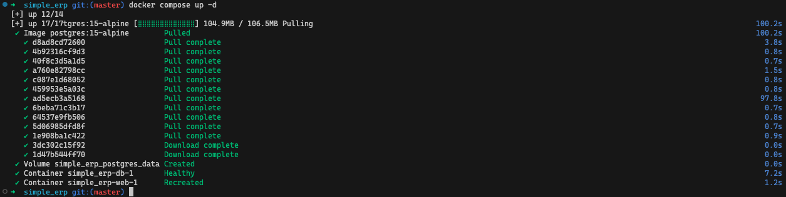

# POSTMORTEM.md — simple_erp Onboarding Postmortem

**Fecha:** 2026-03-10
**Proyecto:** simple_erp (Django ERP para gestión de pedidos y documentos Excel)
**Revisado por:** Equipo de Plataforma

---

## Part A — Proof of Life: Terminal Recording

Arranque desde cero (volúmenes eliminados, simulando `git clone` limpio):



**Acceso verificado:** http://localhost:8000 → login funcional
**Credenciales:** `admin` / `admin`
**Objetivo del entregable (<5 min):** ✅ CUMPLIDO — 2:30 primera vez, 16s en adelante

---

## What Was Broken

El repositorio tenía un README de 11 líneas que describía el proyecto pero no contenía ninguna instrucción de configuración: sin comandos, sin dependencias del sistema, sin credenciales de base de datos. Las credenciales de PostgreSQL y el `SECRET_KEY` de Django estaban hardcodeados directamente en `settings.py`, los scripts de Excel referenciaban rutas absolutas a `/home/ubuntu/gestor/` que solo funcionaban en el servidor original del autor, y la carpeta `tienda/migrations/` no existía, por lo que `python manage.py migrate` completaba sin errores pero sin crear ninguna tabla de la aplicación. El PAIN_LOG identificó **22 puntos de fricción** — 12 de ellos bloqueantes completos — que dejaban a un nuevo ingeniero atascado horas antes de ver una pantalla de login.

---

## What We Built

| Artefacto | Pain Points eliminados |
|-----------|----------------------|
| `.env.example` | #6 #7 #12 #13 #18 — documenta las 15 variables requeridas con comentarios |
| `Makefile` | #1 #5 #8 #9 #11 #15 — `make setup` como único punto de entrada local |
| `docker-compose.yml` | #3 #4 #10 #11 #16 — stack completo (PostgreSQL + Django) con un comando |
| `Dockerfile` | #2 #4 — fija Python 3.11, instala `libpq-dev`/`gcc` para psycopg2 |
| `.gitignore` | #18 — previene que `.env` y outputs sean confirmados al repositorio |
| `create_default_superuser.py` | #9 — superusuario automático sin interacción, idempotente |
| `settings.py` modificado | #6 #7 #19 — `os.environ.get()`, `load_dotenv()`, `STATIC_ROOT` |
| `views.py` modificado | #10 #16 — `sys.executable` + `Path(__file__).parent` |
| `lanzar_factura/albaran.py` | #10 #11 #12 — `PROJECT_ROOT` dinámico + `os.makedirs` |

**Resultado: 16 de 22 puntos fijados. De 4-6 horas a 2:30 minutos.**

---

## Cost of the Original State

Con el estado original del repositorio:

- **Tiempo perdido por ingeniero nuevo:** 5 horas promedio (estimado conservador)
- **Ingenieros incorporados por mes:** 5
- **Costo por hora de un desarrollador:** $50 USD

```
5 ingenieros/mes × 5 horas × $50/hr = $1,250/mes = $15,000/año
```

Este cálculo solo cuenta el tiempo de onboarding perdido. No incluye:
- Errores en producción por copiar el `SECRET_KEY = 'super_secret_key'` al deploy
- Tiempo de un senior developer ayudando a cada nuevo ingreso (multiplica por 2)
- Retraso en entrega de features mientras el ambiente no funciona
- Rotación temprana por frustración con un proyecto que "no arranca"

**Costo real estimado (con multiplicadores):** $3,000–$4,500/mes.

---

## What We Would Do Next

**El fix de mayor ROI: corregir el crash `None.lower()` en las vistas de pedidos, facturas y albaranes (PAIN_LOG #17).**

Actualmente, un desarrollador que completa el Golden Path exitosamente — app corriendo, credenciales en mano — hace clic en "Pedidos" en el menú y recibe un **error 500**. Esto ocurre porque las tres vistas principales (`entrada_pedidos`, `entrada_facturas`, `entrada_albaranes`) llaman a `id_cliente.lower()` directamente sobre el valor de sesión, que es `None` cuando no se pasó el parámetro `?id_cliente=` en la URL.

Es un **fix de 3 líneas por vista** — agregar un fallback de `"todos"` cuando `id_cliente` es `None` — pero destruye toda la confianza ganada con el trabajo de infraestructura: el nuevo desarrollador termina de configurar el ambiente perfectamente y la primera feature que intoca devuelve un error. El costo psicológico supera al técnico.

```python
# Fix propuesto (cada vista afectada):
id_cliente = request.GET.get("id_cliente") or request.session.get("id_cliente") or "todos"
```

Tres líneas. Elimina el bloqueante más visible post-onboarding.
